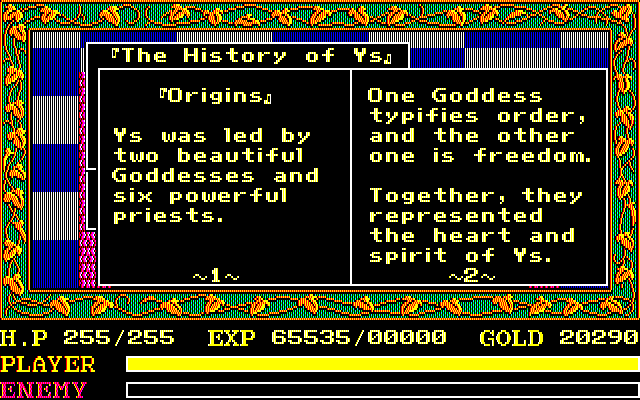
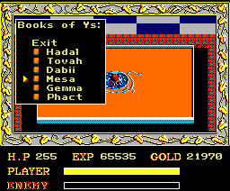
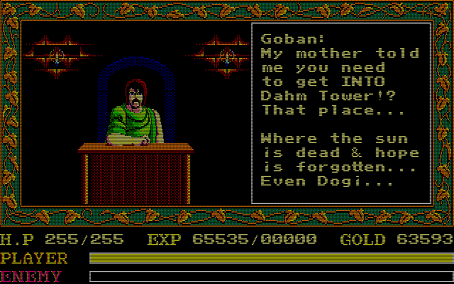
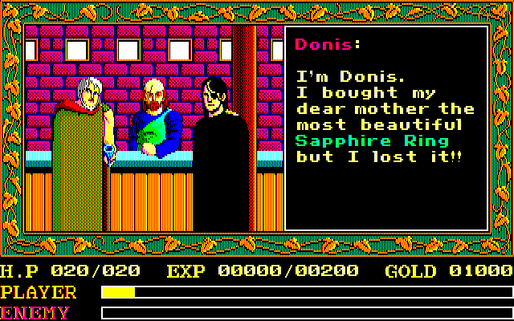

# Ancient Ys Vanished Omen (English Translation)

## Foreward:
This has been a fun project that I’ve immersed myself in over the past several months. What started as a rudimentary romhacking attempt ended up spiraling into an adventure in z80 assembly! Initially, I thought this game was simple and short enough that I’d just replace the text and get the ‘jist’ of things. I wanted to do this because [at the time] there was no translation for the PC-88 version, which seemed criminal to me considering how impactful and influential this game was. 

## What’s in the Patch?

#### PC-88:

* Variable Width Font - Characters like ‘i’ and ‘l’ use half the screen space as most other characters.
* Dictionary Compression allows for more than twice the amount of text to be used (assuming you have the screen real estate, of course)!
* Inventory/Affordability checks now wait for the player to press a key before clearing the message (The original code displays/clears this message very quickly).
* Personalized item acquisition messages (like in Eternal/Chronicles). This allows for some nuance between different items the player obtains throughout their adventure.
* Color Text Highlighting
* "Paging" System for Textboxes:
    * "Normal" or "Field" text boxes can now support more than one text box in the same event. Previously, each text window was a single use deal, but now additional windows can be cascaded.
    * "Shop" or "House" text boxes can now support infinite additional "windows" within the same event. 
    * “Book Emulation” for the books to look more like books when you read them!

#### SharpX1:

* Variable Width Font - Characters like ‘i’ and ‘l’ use half the screen space as most other characters.
* Dictionary Compression allows for more than twice the amount of text to be used.
* Inventory/Affordability checks now wait for the player to press a key before clearing the message.
* "Shop" or "House" text boxes can now support infinite additional "windows". 

#### MSX2:

* Variable Width Font - Characters like ‘i’ and ‘l’ use half the screen space as most other characters.
* Inventory/Affordability checks now wait for the player to press a key before clearing the message; The original code displays (and clears) this message very quickly.
* Color Text:
    * Main font color changed to match other versions
    * Secondary font for "highlighting"
    * Tertiary font for Inventory - Originally, the highlighting on this screen is not very apparent. The new color scheme is a bit more distinct.
* 'ENEMY' text on HUD changed to match other versions

#### Fujitsu Micro FM-7/FM77AV and PC-98:

* Font - Custom ligature glyphs allow for a faux-text scaling effect, which helps with the limited display area for text in shops & houses.

## Translation Notes
This translation aims for a balance between honoring the original vision while taking newer entries into consideration. I wanted to be true to Tomoyoshi Miyazaki’s & Masaya Hashimoto's vision first and foremost, so I sought to _understand_ the game as best I could. It’s interesting how playing through a game while translating it will give you a certain kind of perspective of things, and then learning more about the sources of inspiration for things may either enhance or even change that perspective completely!

It seems almost every single version of Ys I is largely based on the script of the original PC-88 release, and in the cases of the Sharp X1, MSX2, FM-7, FM-77AV, and PC-98 releases is virtually identical (and the English MS-DOS and Apple II GS releases are fairly accurate translations of this original script, too)! With this in mind, the various translation differences we’ve seen over the years become more intriguing, and give a deeper insight to the script as a whole.

For example, in the bar you meet a man who lost something. The original MS-DOS/Apple II GS releases [correctly] translate his words to indicate the object was a gift for his mother. However, the English localization for the Turbo Duo remake changed this to be a gift for his wife, and even the much more recent English release of Chronicles sticks with this idea (in all versions, he isn’t keen to return home without it). This is a very subtle thing, but I think it ends up making a very different character in the end:
* The original version of the character seems to be holding his mother in a very high regard, and is in a state of despair because he wanted to do something special for her.
* The changed version of the character seems instead to be scared of his wife, as he suggests he’ll be in some sort of “trouble” if he returns without it.

The more I think about what either of those situations, the more different they seem to feel, thus I felt it all the more important to stick with the original concept. However, this does not mean this translation is 100% true to every original word, as other areas of the script have certainly had some “liberties” taken (though I always strove to make sure everything fit the themes of Miyazaki’s story).

A much more (SPOILER-laden) in-depth overview of changes is in the attached #CHANGES file (which almost feels long enough to be considered GhaleonX’s Book of Ys).

### Special Thanks:
A super-massive __SPECIAL THANKS__ goes out to Mr. Hiromasa Iwasaki (of Hudson Soft), who was kind and welcoming enough to answer any and every Ys question I could think of! As it turns out, he is quite the expert on the lore of Ys I & II (as he should be, considering he did the PC Engine port). 

I’d also like to thank Mr. Jakes of _Basement Brothers_' youtube channel introducing me to the NEC PC-88 and its wonderful library of games (especially how to boot and navigate each title) through the numerous videos uploaded. The videos on Asteka and Ys were also particularly insightful for this project! 

The wonderful people of the #pc98_translation_discussion discord channel for language help (especially mizuwari & shintocetra), as well as pointing out additional resources, and the talented romhackers in the RHDI discord channel (calico, ManxomeBromide, abridgewater, Mugi, danke, seabassapologist, +others) for various input and encouragement as the project progressed.

Kaisaan & Fishbone for reaching out to me, inviting me to the GeoFront and Dandelion communities Danchou Xavier for linking me to the translated manual by generic_archiver on archive.org

NightWolve for access to his Ys I Chronicles script for reference

Neill Corlett for helping me get into romhacking 20 years ago and inspiring me to assembly hack

RunningSnakes for helping me set up my wii to play PC88, PC98 and MSX

Ian Michael for helping me set up X1 Millennium on the Dreamcast

### Tools/Resources Used:
* Text Edit / Notepad
* Tile Molester
* WindHex
* Hex Fiend
* m88
* quasi88
* quasi88-wii
* Random House Japanese-English English-Japanese Dictionary, Ballantine Books 10th Edition, 1996
* A Guide to Reading & Writing Japanese (Revised Ed), Charles E. Tuttle Company 77th printing, 1996
* generic_archiver’s Ys I PC-88 Manual Scan + Translation
* Google search engine
* Google translate
* Google AI (used to learn z80 assembly and help with debugging/reverse engineering)
* Rannome (https://rcktrncn.github.io/mysite)
* NightWolve’s Ys Chronicles script
* XSEED’s Ys Chronicles script
* Hudson’s PC-Engine/TurboGrafx-16 Ys script
* BulletEyeGames’s PC-8801 Ys Script
* youtube:
    * BulletEyeGames | __Ys I: Ancient Ys Vanished (Falcom, 1987, PC-88) playthrough__ | (_Self-Translated Playthrough_)
    * sayak@ | _Japanese PSP playthroughs_
    * LaTanaDiMrX | __Various__ | (_English SMS and Japanese PCE/Saturn Playthroughs_)
    * Basement Brothers | __Various__ | (_Ys, Asteka, and general Falcom history_)
    * kinako | __PCエンジンの世界__ | (_Ys Development History_)
    * My General’s Channel | __Gaming Commercials 30: MSX Ys Commercial__
    * GCMC:ゲームCMコレクター | __Ys commercials “イース 関連CM集 1987 - 2017年”__
    * U Can Beat Video Games | _Ys Playthrough_

$$
\sum_{x=1}^{G}{nygmaSoft}
$$
